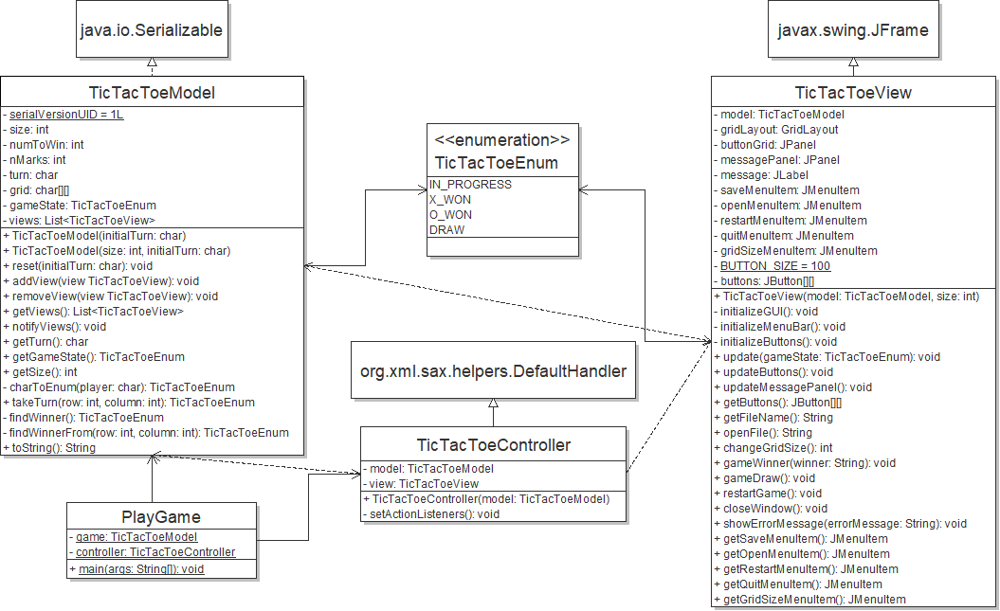

# Tic Tac Toe

SYSC 3110 - Carleton University

A simple Tic Tac Toe implementation created for the purpose of practicing the Model-View-Controller pattern, and the Swing GUI toolkit. 

## UML Class Diagram

## Roadmap

- Detection of diagonal win [COMPLETE]
- Complete JUnit test suite of model